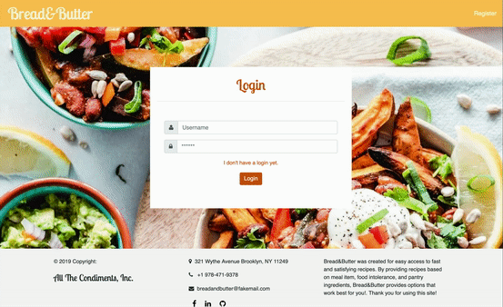
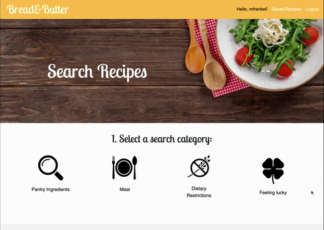
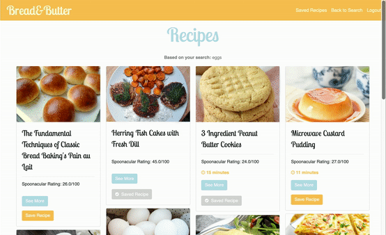

# Bread&Butter

## I. About

_Bread&Butter_ is an interactive Flask web application that allows users to search recipes derived from the Spoonacular 
recipe API based on ingredient, dish-type, and dietary restrictions. The application also allows users to save 
recipes for later viewing and use!

## II. User Navigation + Usage

All users of the _Bread&Butter_ website will first be asked to login with their credentials. If none exist, 
they may navigate to the registration page and submit information to create a user. Note that if a username 
is already taken, the customer will be prompted to provide another username. Upon account creation, users are 
redirected back to the login page to login.

<p align="center">
  
</p>


Once the user has been authenticated, they will be brought to the website's main landing page where they can search 
for recipes. A user can choose to search by any of the following:

1. Ingredients available in their pantry, adding one item at a time (e.g., apples, chicken, eggs)
2. Dish item (e.g. dessert, appetizer, etc.)
3. Dietary restrictions (e.g., gluten-free, dairy-free, etc.)

Upon clicking one of the options, a user will be prompted to provide more search information.

<p align="center">
  
</p>

Once a user submits their search, they will be lead to a webpage of 10 recipe results which contain recipe 
pictures, titles, ratings and time to make (if available) in a titled format. Note that results are limited to 10 
recipes to maximize the number of results returned while minimizing the amount of waiting time for the user.

Here, a user may choose see more information about the recipe by opening a recipe's page, which contains more
information about allergens, ingredients, and instructions and includes a button to save the recipe. Users may also
save recipes directly on the recipe search page. In order to see all recipes saved, users can click on the 
`Recipes Saved` option in the navigation bar, where the option to logout is also provided.

<p align="center">
  
</p>

## III. Website Components

### Spoonacular API
This application sources all of its recipe information, ratings and images from the freely-available Recipe-Food-Nutrition
API by Spoonacular (read more here: https://tinyurl.com/yy4ck2wz) found on the RapidAPI website (https://rapidapi.com/).

Utilization of the Spoonacular API is defined in the `spoonacular_api.py` file of this repository. 
See more about how to setup access to this API under the section about environmental variables below.

### Flask

This website is supported by the Python microframework called Flask, with routes configured
in this project's `application.py` file. 

As defined in this file, users can make `GET` requests from the following endpoints:
* `/`: redirects to the login or search pages, depending on if they're currently authenicated.
* `/login`: allows a user to login to the site.
* `/logout`: where a user can see their logout page.
* `/register`: allows users to register for an account.
* `/search`: where a user may search for recipes.
* `/recipe`: will redirect a user to the search page.
* `/details/<int:spoonacular_id>`: will provide the recipe page for a given recipe, by spoonacular id.
* `/saved_recipes`: will provide all recipes saved by the logged in user.

`POST` requests are also available to the `/login`, `/register`, `/save_recipe`, and `/search` routes, 
where data may be processed, retrieved, or added to the database.

### Database
User data that supports the _Bread&Butter_ site is stored in a Postgres database that was configured
using Heroku. Two database tables currently exist as part of this project:

* `Users`: contains login, registration information about each user.
* `UserSavedRecipes`: contains user_ids and recipe_ids for any recipes that users request to save for later viewing.

Configurations of the database can be found in the `models.py` file of this repository. Note that this project
uses SQLAlchemy ORMs to interact with the Postgres database using Python.

### HTML + CSS

This application utilizes the HTML pages outlined below. Each page extends the template `layout.html` and utilizes
`styles.css` for formatting.
* `login.html`: surfaces the login page for the user, with specific formatting from `login.css`.
* `register.html`: surfaces ther registration page for the user, with specific formatting from `login.css`.
* `search.html`: surfaces the search page of the website, with specific formatting from `search.css`.
* `single_recipe.html`: shows the customer a single recipe, with specific formatting from `single_recipe.css`.

Templating was achieved using Jinja2.

### JavaScript

JavaScript was utilized to provide users with a more dynamic experience on the search page, to show a user that the
webpage is loading, and to enable users to save a recipe without needing to reload HTML from the server. The script 
`static/recipes.js` serves elements on the `recipes.html` and `single_recipe.html` pages, while `static/search.js` 
is used on the `search.html` page.

### Security

This application makes use of the `Flask-Login` module to manage user creation, authentication, and logout. For 
security concerns, no password is stored in the postgres database as plain-text. All passwords are hashed using 
a secure hash algorithm (SHA-256) before storage.

## IV. Usage Locally

In order to deploy _Bread&Butter_ locally, please follow the steps below.

### Setup 

#### 1. Create local python environment
Packages required for this project are outlined in `requirements.txt`. You may create a 
virtual environment with these requirements using the following commands:

(1) Create your virtual environment (venv):
```
$ pip install virtualenv
$ virtualenv venv
``` 

(2) Activate your venv:
```
$ source venv/bin/activate
```
(3) Install your requirements:
```
$ pip install -r requirements.txt
```

#### 2. Set environmental variables
Running this project locally requires configuring several local environmental variables:
* `DATABASE_URL`: the url to the postgres database found under Heroku settings.
* `SECRET_KEY`: a "secret-key" that can be a string of your choosing, but kept secret.
* `FLASK_APP`: an environmental variable should always be set as `application.py`.
* `SPOON_API_KEY`: an API key used to access the Spoonacular API, upon creating an account here (https://rapidapi.com/spoonacular/api/recipe-food-nutrition?).

You may set each environmental variable by following the pattern below:
```
$ export FLASK_APP=application.py
```

It is additionally helpful to tell Flask to run in debug mode during development:
```
$ export FLASK_ENV=development
````

#### 3. Setup Database
In the case that the database is lost, it can be setup locally or recreated in Heroku using the `initialize()` 
method of the `RecipeDatabase` class found in `database.py`, which uses SQLAlchemy in order to manage database sessions, 
as well as create tables.
 
Issue the following command in order to initiate all tables, using this project as your working directory. 
```
$ python create_database.py
```

### Run

With the above steps complete, you may deploy the website locally and review it by running Flask:
```
$ flask run
```
Use the resulting url printed by Flask in any browser.

### Test

Unit tests currently configured for this project can be found in the `tests/` directory. Run tests with the following
command:
```
$ python -m pytest tests/test_app.py
```

## V. Developer Notes 
This project was developed on a Macbook (macOS Mojave) and was primarily developed and tested using Chrome.

### Future Releases
Future releases of _Bread&Butter_ website will provide more search capabilities, including the ability to search by
diet (e.g., vegetarian or vegan), occasion (e.g., holiday, birthday, etc.), and calorie count. Additionally, users 
will be able to submit their own recipes and will be enabled to email recipes to themselves and others.

